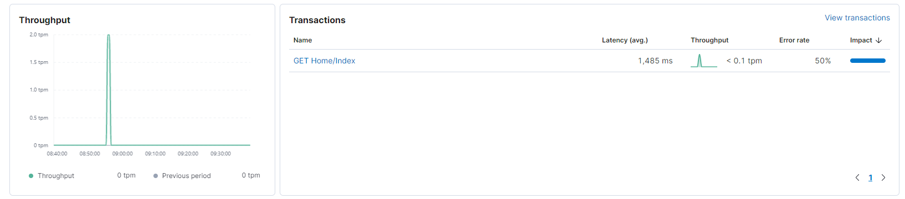
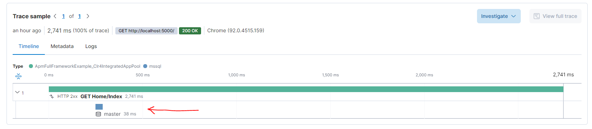

# Elastic APM ASP.NET Full Framework example

An example of using Elastic.Apm and its SQL server client integration
in an ASP.NET Full Framework application. Inspired by a topic on [discuss.elastic.co](https://discuss.elastic.co/t/how-to-view-sql-queries-in-apm/281388)

## Getting started

You'll need the following to run this example

1. A locally running Elasticsearch, Kibana and APM server.
The APM integration testing repository provides a way to programmatically build
a Docker compose file to spin these up. Clone the repository locally and ensure
you have all the prerequisites installed.

   An example command on Windows to spin up Elasticsearch, Kibana and APM server

   ```
   cd apm-integration-testing
   python .\scripts\compose.py start 7.14.0
   ```
   
   The command logs the following to indicate that the stack is ready
   
   ```
   Starting/Building stack services..
   
   Pulling elasticsearch ... done
   Pulling kibana        ... done
   Pulling apm-server    ... done
   Pulling wait-service  ... done
   Creating network "apm-integration-testing" with the default driver
   Creating localtesting_7.14.0_elasticsearch ... done
   Creating localtesting_7.14.0_kibana        ... done
   Creating localtesting_7.14.0_apm-server    ... done
   Creating wait                              ... done
   ```

2. A locally running SQL server. One can be started with docker

   ```
   docker run -e "ACCEPT_EULA=Y" -e "SA_PASSWORD=yourStrong(!)Password" -p 1433:1433 -d mcr.microsoft.com/mssql/server:2017-CU8-ubuntu
   ```

3. Now run the ASP.NET Full Framework application.

4. Navigate to the home page of the application, which makes a request to SQL server.

5. Observe in the APM UI in Kibana at `http://localhost:5601/app/apm/services/ApmFullFrameworkExample_Clr4IntegratedAppPool/` that there is a transaction for the request

   

6. Navigate to the transaction and observe that a DB span is shown on the Trace sample

   
